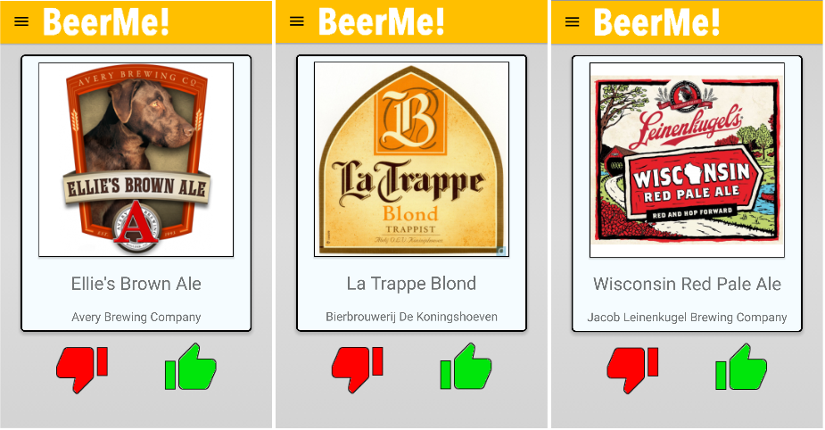
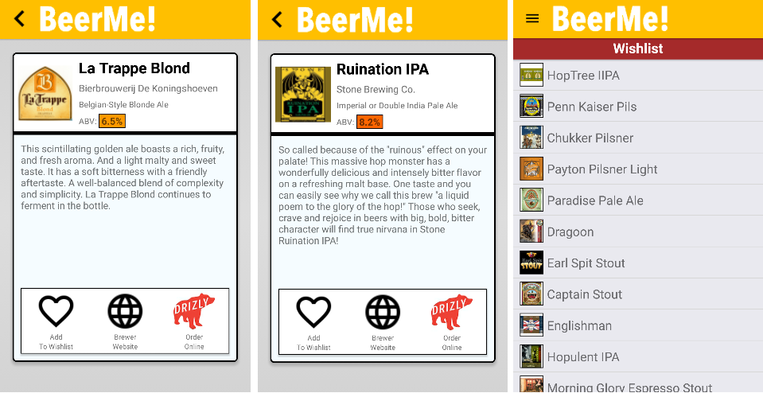
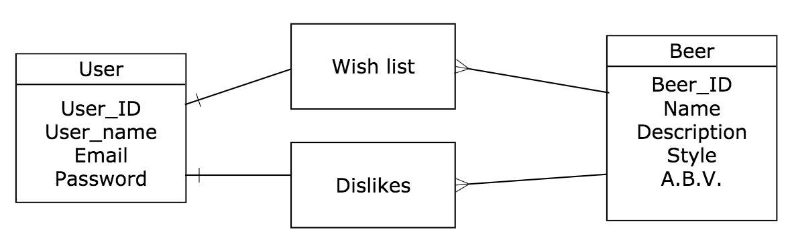

# BeerMe! for Android

Swipe your way to craft-beer nirvana with BeerMe!, a fun way to expand your beer-drinking palette.

### How It Works

Log in, choose a style, and swipe through a continuously reloading assortment of beers, Tinder-style. 

If a brew catches your eye, swipe right to learn more about it. Check out the brewer's website, find an online retailer, or add it to your wishlist for future consideration. 

 

BeerMe! is available on the Google Play Store or at [play.google.com/store/apps/details?id=com.beermeandroid](https://play.google.com/store/apps/details?id=com.beermeandroid). 

### Tech

The BeerMe! for Android tech stack includes the following languages and frameworks ...

* React Native 0.28
* Redux 3.5.2
* React Native Router Flux 3.30.6
* Axios 0.12

... paired with a Node/Express back end, the code for which (along with iOS components written in Swift) can be found [here](https://github.com/Cygnus2112/BeerMe).

Code for Tinder functionality was swiped (ha!) from [Brent Vatne's demo](https://github.com/brentvatne/react-native-animated-demo-tinder).

Beer and brewery data courtesy of the very awesome [BreweryDB](http://www.brewerydb.com).

### Entities

* User
* Wishlist
* Dislike
* Beer

