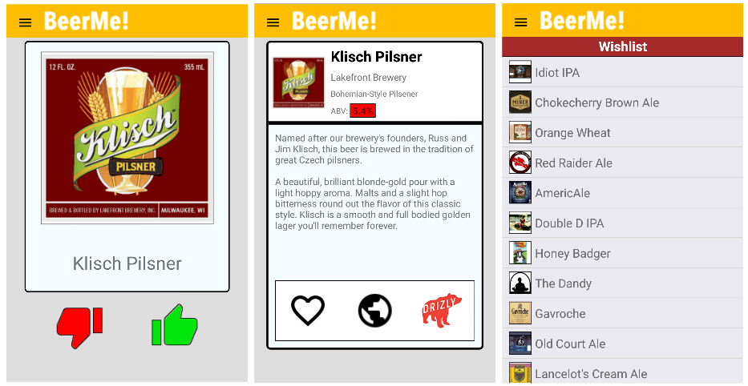

# BeerMe! for Android
The world-famous iOS beer discovery app, now available on Android!

Swipe your way to craft-beer nirvana with BeerMe!, a fun way to expand your beer-drinking palette. (This just the front end, and is meant to be paired with the existing [BeerMe!](https://github.com/Cygnus2112/BeerMe) back end.)

####How It Works

Log in, choose a style, and swipe through a continuously reloading assortment of beers chosen at random. 

The BeerMe! for Android tech stack includes the following languages and frameworks...

* React Native 0.28
* Redux 3.5.2
* React Native Router Flux 3.30.6
* Axios 0.12

... and that's pretty much it. Of course, there's tons of stuff going on under the hood, but we don't need to worry about any of that, because React Native. It's freaking magical.
